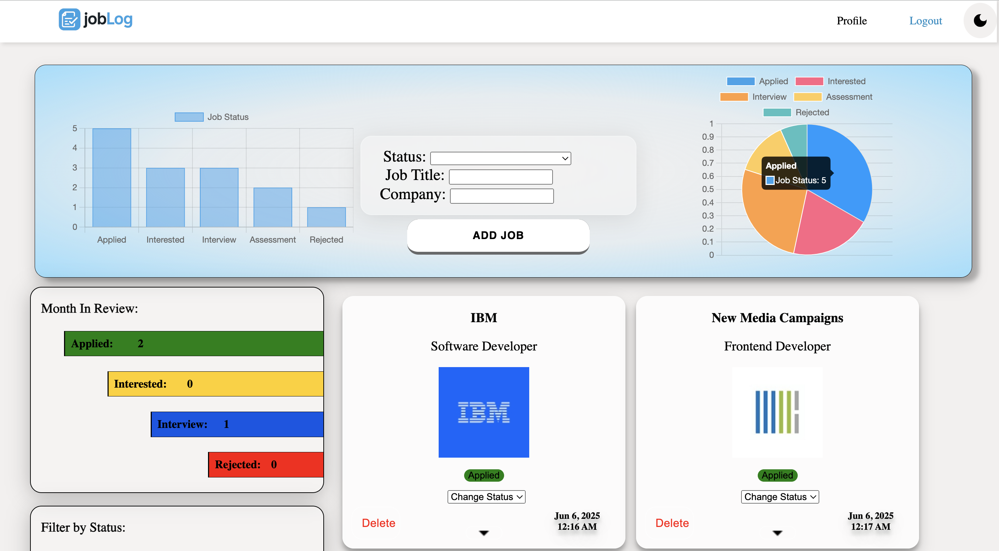
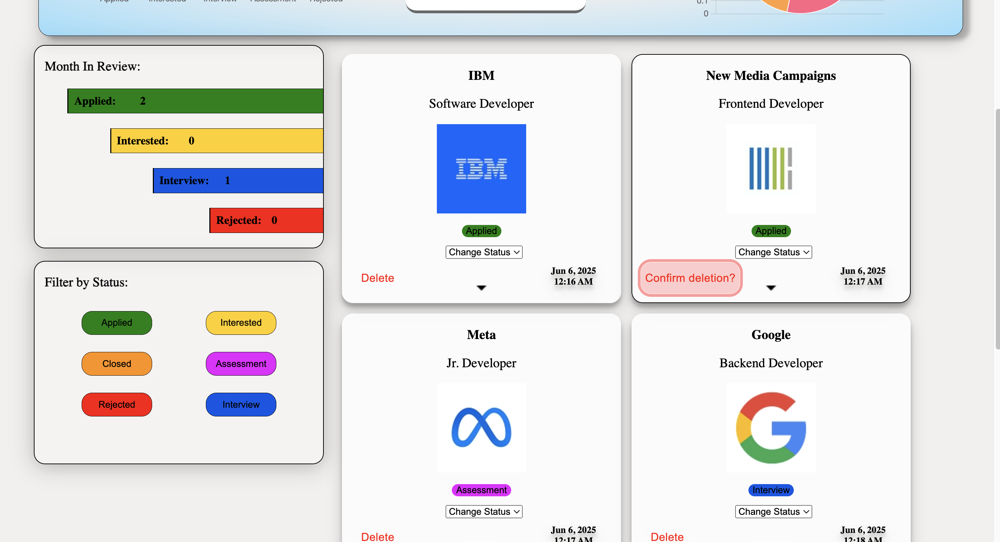

# JobLog




## Description
**JobLog** is a web application that helps users track their job applications. Users can enter job details, including:
- Job Title
- Company Name
- Job Status (Applied, Interested, Closed, Assessment, Rejected, Interview)

Once added, the app displays job entries as cards, incorporating the **logo.dev API** to fetch and display company logos dynamically. Additionally, **Chart.js** is used to visualize job application statuses in graphs, allowing users to track their progress at a glance.

This project is currently a **work in progress**.

## Features
- Add job applications with relevant details.
- Automatically fetch company logos using **logo.dev API**.
- Display job applications as interactive cards.
- Visualize job status distribution with **Chart.js-powered graphs**.

## Technologies Used
- **JavaScript** (Frontend & Backend)
- **Express.js** (Backend framework)
- **Chart.js** (Data querying and visualization)
- **HTML/CSS** (Frontend structure and styling)

## Installation & Setup
1. Clone the repository:
   ```sh
   git clone https://github.com/yourusername/JobLog.git
   cd JobLog
   ```
2. Install dependencies:
   ```sh
   npm install
   ```
3. Start the server:
   ```sh
   node server.js
   ```
4. Open the app in your browser.

## Roadmap
- [✅] Improve UI/UX
- [✅] Implement user authentication
- [ ] Persist data currently in Mongoose when users login
- [✅] Security middleware
- [ ] Error handling
- [ ] Implement filter by status feature
- [ ] Finish Chart.js data visualization

---
**Author:** Marquette Hanson

